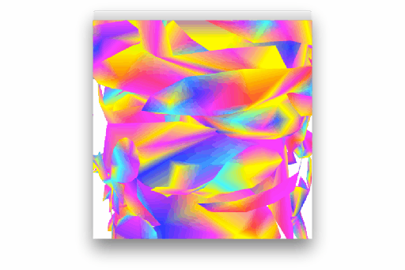

# gifgen

GIF Builder from image sequence

## Usage

1. Clone the repo
2. `npm install`
3. Open in Plask
4. Drag'n'drop images
5. Gif will be created in the same directory as the first image

## License

MIT, see [LICENSE.md](http://github.com/vorg/gifgen/blob/master/LICENSE.md) for details.
